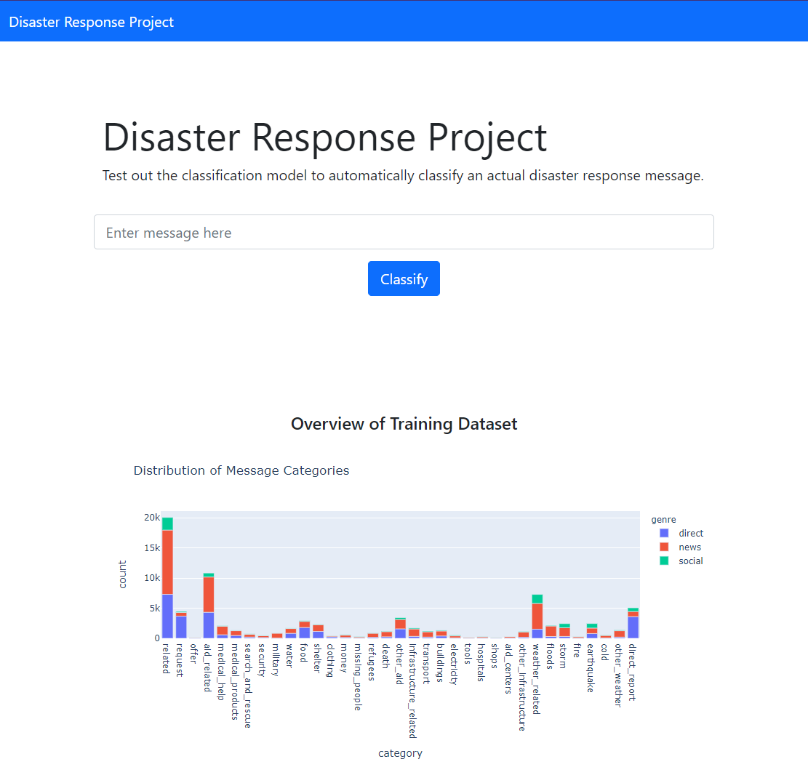
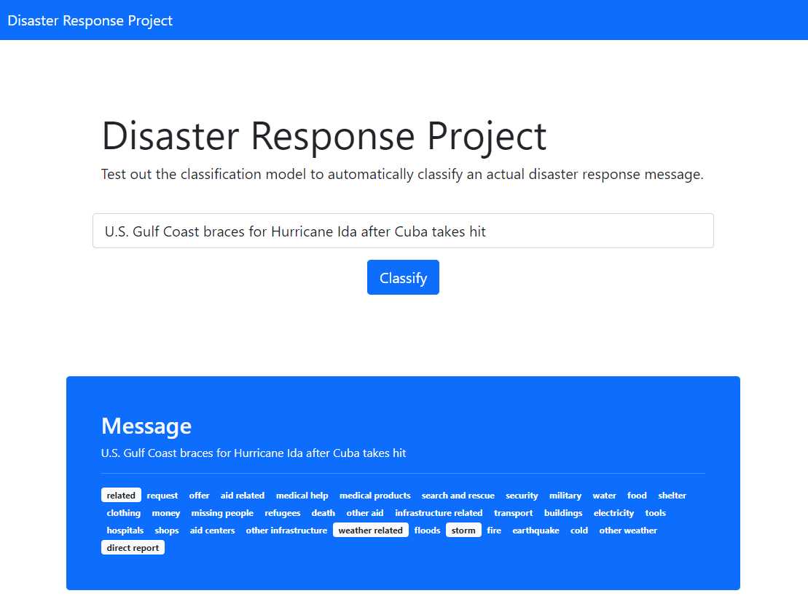

# Disaster Response Pipeline Project

F8 Disaster Response - Message Classification Pipeline Project

### Table of contents
1. [Getting Started](#installation)
2. [Project Motivation](#motivation)
3. [File Descriptions](#folders)
4. [Study Notes](#notes)
5. [Licensing, Authors, and Acknowledgements](#licensing)

## Getting Started <a name="installation"></a>

**Preparation**

This project requires Python 3.x. Conda is optional but recommended.

1. If you are using conda or any python environment managers, create any environment and switch to that environment.
2. Go to the root directory of the project. Run `pip install -r requirements.txt`.
3. Run `pip install -e .` to take care of local imports.
4. In the root folder, there's a file `data.zip`. Unzip it and save the contents to `data/raw`. There should be two files in the folder, `disaster_messages.csv` and `disaster_categories.csv`. Create the missing folders as necessary.

**Running the web application**

We are going to start on this step first as it prepares and creates the necessary folders needed both by the web application and running the notebooks.

1. Run the following to wrangle and clean the data and save it to an sqlite database. The filename destinations are important since these are the files that are referenced by the web application.

```
python src/scripts/process_data.py data/raw/disaster_messages.csv data/raw/disaster_categories.csv data/processed/DisasterResponse.db
```

2. Once the execution above is done, `data/processed/DisasterResponse.db` should be created. We are going to use this database for training the model. Run the following to create the model. Again, model filename is important.

```
python src/scripts/train_classifier.py data/processed/DisasterResponse.db models/disaster_response_model.pkl
```

Running the script will take time as it tries to perform a number of fits. The model will be saved to `models/disaster_response_model.pkl`.

3. Once the database and model are created, change your directory to the web application folder, then run.

```
cd src/app
flask run
```

The web application will be hosted on port 5000. The hosted application has both web app and web API. The endpoints are the following:

App
* `/` or `/index`
   * Home page

API
* `GET api/graph/categories`
   * Returns plotly json for the categories distribution
* `GET api/graph/words`
   * Returns plotly json for word counts
* `GET api/messages/classify?message=<message>`
   * Returns the classification of the message


_fig.1 Home page_


_fig.2 Message classification_

NOTE: The web application will have a slow start (graphs will take time to load) as SQLite databases are not very fast. After the first load, everything should run smoothly.


**Running the notebooks**

If you have done the steps above, the notebooks should run with no problems, since the folders and data needed are already created. Just make sure you use the correct kernel with the environment you used above.

The notebooks are prefixed with number as to indicate which is the first one to run. We recommend to run in this order to simulate the thought process of coming up with the pipeline. The notebooks are located under `notebooks` folder.

These notebooks should run with `Jupyter` and its derivatives including `Visual Studio Code`. Just ensure that you are running it with the environment where you installed `requirements.txt`.

## Project Motivation <a name="motivation"></a>

This project aims to create a pipeline to classify disaster response message into different categories. Also, it will walk you through the steps discussed in the notebooks. The generated code from the notebooks are then transferred to scripts that will make use to automate the pipeline from data wrangling, cleaning, analysis, and modeling. This will greatly speed up later in creating and consuming the model, as well as retraining them when they starts to decay.

## File Descriptions <a name="folders"></a>

Web app and API are hosted in `src/app`.

Notebooks can be found under `notebooks` folder. 

* `01 - ETL Pipeline Preparation.ipynb`
* `02 - ML Pipeline Preparation.ipynb`
* `03 - Data Visualization.ipynb`

Provided 3 scripts to prepare, train and test the model. These are located under `src/scripts`. Usage:

```
python process_data.py <messages_filepath> <categories_filepath> <db_filepath>

python train_classifier.py <db_filepath> <model_filepath>

python test_classfier.py <model_filepath> <message>
```

Lastly, raw data are zipped in the root directory `data.zip`. The contents of the zip file should be saved to `data/raw`.

## Study Notes <a name="notes"></a>

The data provided, although it is already cleaned, there maybe room for improvement in the cleaning process. For example, some of the messages contains non-translated messages, and others are "text shortcuts" that can perhaps be further improved. The http urls are already "pre-tokenized" which makes it hard to automatically clean it through code. We also noticed high occurrence of "000" as word, that when investigated, this is due to currencies, or numbers with thousands separators. 

The data is also imbalance as the number of messages in each category is not equal. Some of the categories have high accuracy, while others (like `child alone`) does not have message with that category at all.

During training the model, I've chosen algorithm that are fast to train. These are Multinomial Naive Bayes, Logistic Regression and Linear Support Vector Classifier. With more powerful computing power, we can also apply K-Nearest Neighbors, Random Forest, Extra Trees, and Gradient Boosting Classifier, but this requires a lot of time to tune and train.

The thought process during tuning with `GridSearchCV` is I tried to look for any configurable components both in text processing and model. I then selected the parameters that greatly impact the score of the models. With that I ended up tweaking the n-grams (unigram, bigram) and the minimum word count (min_df) to get the best score.

## Licensing, Authors, Acknoledgements <a name="licensing"></a>

MIT License